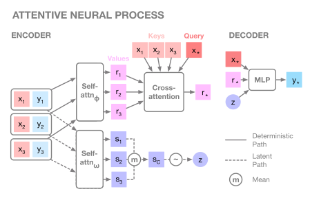
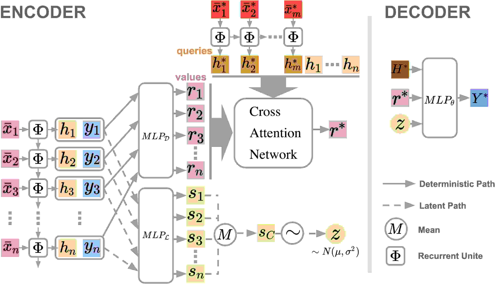
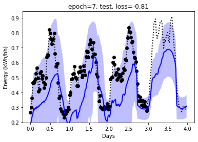
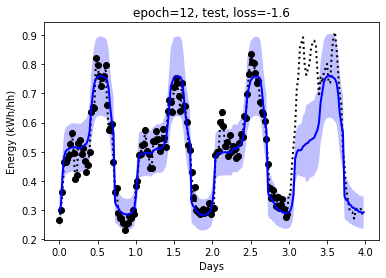
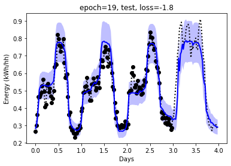
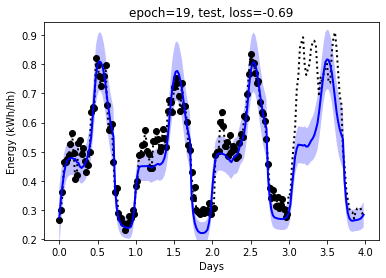
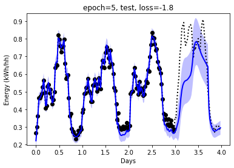

# Using attentive neural processes for forecasting power usage

This project uses [Attentive Neural Process](https://arxiv.org/abs/1901.05761) (ANP) on kaggle smart meter data.

And also implements [Recurrent Attentive Neural Process for Sequential Data](https://arxiv.org/abs/1910.09323) (ANP-RNN)

I'm using them in a weird way since I'm predicting ahead instead of infilling, however they perform well.

I've always made lots of weaks for flexibility and stability and [replicated the deepmind results](anp_1d_regression.ipynb) in pytorch. This seems better than the other pytorch versions of ANP (as of 2019-11-01).

## Usage

- clone this repository
- see requirements.txt for requirements and version
- Start and run the notebook [smartmeters.ipynb](https://github.com/wassname/attentive-neural-processes/blob/master/smartmeters.ipynb)

## Data
- Some data is included, you can get more from https://www.kaggle.com/jeanmidev/smart-meters-in-london/version/11
- Inputs are: 
  - Weather
  - Time features: time of day, day of week, month of year, etc
  - Bank holidays
  - Position in sequence: days since start of window
- Target is: mean power usage on block 0

## Example outputs

Here the black dots are input data, the dotted line is the true data. The blue line is the prediction, and the blue shadow is the uncertainty to one standard deviation.

I chose a a difficult example below, it's a window in the test set that deviates from the previous pattern. Given 3 days inputs, it must predict the next day, and the next day has higher power usage than previously. The trained model manages to predict it based on the inputs.

### LSTM Baseline

Compare this to a quick LSTM baseline below, which didn't predict this divergance from the pattern. (Bear in mind that I didn't tweak this model as much). The uncertainty and prediction are also less smooth and the log probability is lower.

An LSTM with an encoder style similar to ANP's:

and a normal LSTM:

## Code

This is based on the code listed in the next section, with some changes. The most notable ones add stability, others are to make sure it can handle predicting into the future:

Changes for a predictive use case:
- target points are always in the future, context is in the past
- context and and targets are still sampled randomly during training

Changes for stability:
- in eval mode, take mean of latent space, and mean of output isntead of sampling
- use log_variance where possible (there is a flag to try without this, and it seems to help)
  - and add a minimum bound to std (in log domain) to avoid mode collapse (one path using log_var one not)
- use log_prob loss (not mseloss or BCELoss)
- use pytorch attention (which has dropout) instead of custom attention
- use_deterministic option
- use batchnorm and dropout on channel dimensions
- check and skip nonfinite values because for extreme inputs we can still get nan's

## Replicating tensorflow behaviour

I put some work into replicating the behaviour shown in the [original deepmind tensorflow notebook](https://github.com/deepmind/neural-processes/blob/master/attentive_neural_process.ipynb).

Compare deepmind:
- 

And this repo (anp_1d_regression.ipynb)
- 

It's just a qualitative comparison but we see the same kind of overfitting with uncertainty being tight where lots of data points exist, and wide where they do not. However this repo seems to miss points occasionally.

## See also:

A list of projects I used as reference or modified to make this one:

- Original code in tensorflow from hyunjik11 (author of the original paper) : https://github.com/deepmind/neural-processes/blob/master/attentive_neural_process.ipynb
- First pytorch implementation by soobinseo: https://github.com/soobinseo/Attentive-Neural-Process/blob/master/network.py
- Second pytorch implementation KurochkinAlexey (has some bugs currently) https://github.com/KurochkinAlexey/Attentive-neural-processes/blob/master/anp_1d_regression.ipynb
- If you want to try vanilla neural processes: https://github.com/EmilienDupont/neural-processes/blob/master/example-1d.ipynb

I'm very gratefull for all these authors for sharing their work. It was a pleasure to dive deep into these models compare the differen't implementations.
