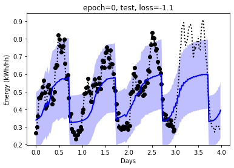
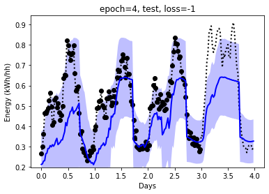
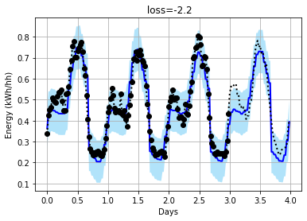

Using attentive neural process for forecasting smartmeter data in pytorch

Changes for stability:
- in eval mode, take mean of latent space, and mean output, don't sample
- use log_variance where possible
  - and add a minimum bound to std (in log domain) to avoid mode collapse
- use pytorch attention (which has dropout)
- use batchnorm and dropout on channel dimensions
- added log_prob loss
- check and skip nonfinite values because for extreme inputs we can still get nan's

# Usage:

- see requirements.txt for requirements
- Download data from https://www.kaggle.com/jeanmidev/smart-meters-in-london/version/11
  - Unzip smart-meters-in-london.zip
  - unzip data/smart-meters-in-london/halfhourly_dataset.zip
  - You should now have the file: `./data/smart-meters-in-london/halfhourly_dataset/block_0.csv`
- Start and run the notebook [smartmeters.ipynb](https://github.com/wassname/attentive-neural-processes/blob/master/smartmeters.ipynb)

# Example outputs:

Here the black dots are input data, the dotted line is the true data. The blue line is the prediction, and the blue shadow is the uncertainty.

# See also:

- Original code in tensorflow: https://github.com/deepmind/neural-processes/blob/master/attentive_neural_process.ipynb
- First pytorch implementation: https://github.com/soobinseo/Attentive-Neural-Process/blob/master/network.py
- Second pytorch implementation (has some major bugs) https://github.com/KurochkinAlexey/Attentive-neural-processes/blob/master/anp_1d_regression.ipynb
- If you want to try vanilla neural processes: https://github.com/EmilienDupont/neural-processes/blob/master/example-1d.ipynb

