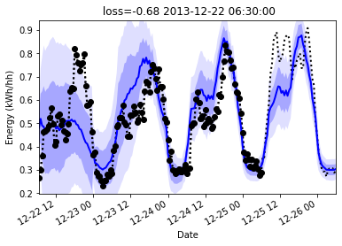
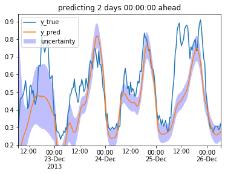
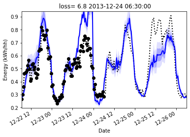
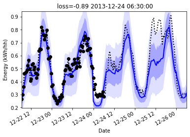
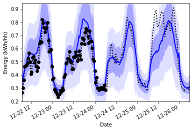
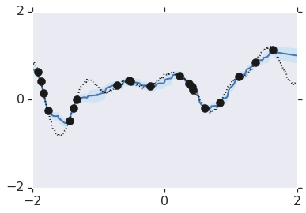
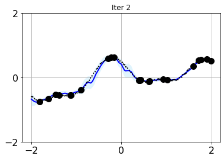
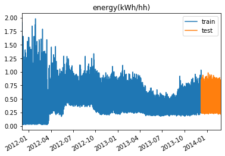
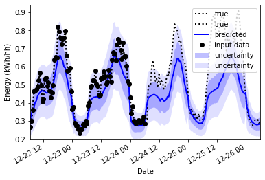

# Neural Processes for sequential data

This repo implements ["Recurrent Attentive Neural Process for Sequential Data"](https://arxiv.org/abs/1910.09323) (ANP-RNN) on a toy regression problem. And also tests it on real smart meter data.

This repository has lots of options so you can run it as a ANP-RNN, or ANP or NP.

- Models
  - ANP-RNN ["Recurrent Attentive Neural Process for Sequential Data"](https://arxiv.org/abs/1910.09323) 
  - ANP: [Attentive Neural Processes](https://arxiv.org/abs/1901.05761)
  - NP: [Neural Processes](https://arxiv.org/abs/1807.01622)
  - LSTM
- Experiments:
  - Monte Carlo Dropout
- Data:
  - Toy 1d regression
  - Power prediction problem

I've also made lots of tweaks for flexibility and stability and [replicated the DeepMind ANP results](anp_1d_regression.ipynb) in pytorch. The replication qualitatively seems like a better match than the other pytorch versions of ANP (as of 2019-11-01). You can see other code repositories in the see also section.

It's not heavily documented, because most of my code never gets read or used. If you are using it, and it's confusing, make a github issue are we will add comments or docs together.

- [Neural Processes for sequential data](#neural-processes-for-sequential-data)
  - [Experiment: Comparing models on real world data](#experiment-comparing-models-on-real-world-data)
    - [Results](#results)
    - [Example LSTM baseline](#example-lstm-baseline)
    - [Example NP](#example-np)
    - [Example ANP outputs (sequential)](#example-anp-outputs-sequential)
    - [Example ANP-RNN outputs](#example-anp-rnn-outputs)
    - [Example of ANP-RNN with MCDropout](#example-of-anp-rnn-with-mcdropout)
  - [Experiment: Comparing models on toy 1d regression](#experiment-comparing-models-on-toy-1d-regression)
    - [Results](#results-1)
      - [Example outputs](#example-outputs)
  - [Experiment: Using ANP-RNN + Monte Carlo Dropout](#experiment-using-anp-rnn--monte-carlo-dropout)
  - [Usage](#usage)
    - [Smartmeter Data](#smartmeter-data)
    - [Code](#code)
  - [ANP-RNN diagram](#anp-rnn-diagram)
  - [Tips](#tips)
  - [See also:](#see-also)
- [Citing](#citing)

## Experiment: Comparing models on real world data

Here I compare the models on smartmeter power demand data.

The black dots are input data, the dotted line is the true data. The blue line is the prediction, and the blue shadow is the uncertainty to one standard deviation.

I chose a difficult example below, it's a window in the test set that deviates from the previous pattern. Given 3 days inputs, it must predict the next day, and the next day has higher power usage than previously. The trained model manages to predict it based on the inputs.

### Results

Results on [*Smartmeter* prediction](./smartmeters-ANP-RNN.ipynb) (lower is better)

|Model|val_np_loss|val_mse_loss|
|--|--|--|
| **ANP-RNN(impr)(MCDropout)**| **-1.48**|
|**ANP-RNN_imp**|**-1.38**|.00423
|ANP-RNN|-1.27|0.0047|
|ANP|-1.3|0.0072|
|NP|-1.3|0.0040|
|LSTM|-0.78| 0.0074  |

### Example LSTM baseline

Here is an LSTM with a similar setup: it has access to the y value in the context (first half). It's output is inferier and it's uncertainty estimation if poor. It starts of high since it hasn't had much data yet, but it should increase, or at least stay high in the second half as it moves away from it's data.

### Example NP

Here we see underfitting, since the curve doesn't match the data

### Example ANP outputs (sequential)

Here we see overfitting, but the uncertainty seems to small, and the fit could be improved

### Example ANP-RNN outputs

This has a better calibrated uncertainty and a better fit

### Example of ANP-RNN with MCDropout

## Experiment: Comparing models on toy 1d regression

I put some work into replicating the behaviour shown in the [original deepmind tensorflow notebook](https://github.com/deepmind/neural-processes/blob/master/attentive_neural_process.ipynb). At the same time I compared multiple models.

### Results

Results on [toy 1d regression](./anp-rnn_1d_regression.ipynb)  (lower is better)

|model|val_loss|
|-----|---------|
| **ANP-RNN(impr)**| **-1.3217**|
| ANP-RNN| -0.62|
| ANP| -0.4228|
| ANP(impr)| -0.3182|
| NP|  -1.2687 |

#### Example outputs

Compare deepmind:

And this repo with an ANP (anp_1d_regression.ipynb)

And a ANP-RNN

It's just a qualitative comparison but we see the same kind of overfitting with uncertainty being tight where lots of data points exist, and wide where they do not. However this repo seems to miss points occasionally.

## Experiment: Using ANP-RNN + Monte Carlo Dropout

One more experiment is included:

The model tries to estimate the how unsure it is, but what about when it is out of sample? What about what it doesn't know that it doesn't know?

|Name|val_loss (n=100) [lower is better]|
|--|--|
|MCDropout| -1.31|
|Normal| -1.04|

We can estimate additional uncertainty by using Monte Carlo Dropout to see how uncertain the model acts in the presence of dropout. This doesn't capture all uncertainty, but I found that is does improve (decrease) the validation loss. The loss is calculated by the negative overlap of the output distribution and the target value so this improvement in the loss shows that MCDropout improved the estimation of the uncertainty.

Why didn't the model just learn to be more uncertain? Well I choose a challenging train, val/test split where the val data was in the future and showed quite differen't behaviour. That means that the validation data had behaviour the model has never seen before. 

With MCDropout:

Without

For more details see the notebook [./smartmeters-ANP-RNN-mcdropout.ipynb](./smartmeters-ANP-RNN-mcdropout.ipynb)

## Usage

- clone this repository
- see requirements.txt for requirements and version
- Start and run the notebook [smartmeters.ipynb](smartmeters-ANP-RNN.ipynb)
- To see a toy 1d regression problem, look at [anp-rnn_1d_regression.ipynb](anp-rnn_1d_regression.ipynb)

### Smartmeter Data
- Some data is included, you can get more from https://www.kaggle.com/jeanmidev/smart-meters-in-london/version/11
- Inputs are: 
  - Weather
  - Time features: time of day, day of week, month of year, etc
  - Bank holidays
  - Position in sequence: days since start of window
- Target is: mean power usage on block 0

### Code

This is based on the code listed in the next section, with some changes. The most notable ones add stability, others are to make sure it can handle predicting into the future:

Changes for a sequential/predictive use case:
- target points are always in the future, context is in the past
- context and targets are still sampled randomly during training

Changes for stability:
- in eval mode, take mean of latent space, and mean of output isntead of sampling
- use log_variance where possible (there is a flag to try without this, and it seems to help)
  - and add a minimum bound to std (in log domain) to avoid mode collapse (one path using log_var one not)
- use log_prob loss (not mseloss or BCELoss)
- use pytorch attention (which has dropout and is faster) instead of custom attention
- use_deterministic option, although it seems to do better with this off
- use batchnorm and dropout on channel dimensions
- check and skip nonfinite values because for extreme inputs we can still get nan's. Also gradient clipping
- use pytorch lightning for early stopping, hyperparam opt, and reduce learning rate on plateau

## ANP-RNN diagram

## Tips

- Make you normalise all data, ideally the output two, this seems to be very important
- Batchnorm, lvar, dropout: it's unclear to me how to make these help reliably
- The deterministic path had unclear value, I found it best to leave it out
- The size and comparitive size of the context and target is important for performance.
  - If the context is too long and complex the model cannot summarize it
  - If the target is too long and complex hte model cannot fit it well
  - If the context is in the target, the model may collapse to just fitting this. To fix
    - make it small
    - or make the loss on this part downweighted, this seems like the best approach since x_context->y_context may still be a usefull secondary task
    - or do not include context in target

## See also:

A list of projects I used as reference or modified to make this one:

- Original code in tensorflow from hyunjik11 (author of the original paper) : https://github.com/deepmind/neural-processes/blob/master/attentive_neural_process.ipynb
- First pytorch implementation by soobinseo: https://github.com/soobinseo/Attentive-Neural-Process/blob/master/network.py
- Second pytorch implementation KurochkinAlexey (has some bugs currently) https://github.com/KurochkinAlexey/Attentive-neural-processes/blob/master/anp_1d_regression.ipynb
- If you want to try vanilla neural processes: https://github.com/EmilienDupont/neural-processes/blob/master/example-1d.ipynb

I'm very grateful for all these authors for sharing their work. It was a pleasure to dive deep into these models compare the different implementations.

Neural process papers:

- [2019-10-17, "Recurrent Attentive Neural Process for Sequential Data"](https://arxiv.org/abs/1910.09323) - LSTM on X before encoder, no code
- [2019-10-29, "Convolutional Conditional Neural Processes"](https://arxiv.org/abs/1910.13556). [code](https://github.com/cambridge-mlg/convcnp)
- [2019-10-01, "Wasserstein Neural Processes"](https://arxiv.org/abs/1910.00668) would be helpfull if the output dist never converges for your problem
- [2019-08-08, "Spatiotemporal Modeling using Recurrent Neural Processes"](https://www.ri.cmu.edu/wp-content/uploads/2019/08/msr_thesis_document.pdf) (infilling spatial information, using a RNN for time information, no code)
- [2019-06-13, "Recurrent Neural Processes"](https://arxiv.org/abs/1906.05915) (2d and 3d over time, using LSTM in encoder/decoder, no code)
- [2019-06-19, "The Functional Neural Processes"](https://arxiv.org/abs/1906.08324)
- [2019-01-17, "Attentive Neural Processes"](https://arxiv.org/abs/1901.05761) (using attention to prevent underfitting) [code](https://github.com/deepmind/neural-processes)
- [2018-07-04, "Conditional Neural Processes"](https://arxiv.org/abs/1807.01613) [code](https://github.com/deepmind/neural-processes)
- [2018-07-04, "Neural Processes"](https://arxiv.org/abs/1807.01622)

Blogposts:
- [2018-08-10, "Neural Processes as distributions over functions"
](https://kasparmartens.rbind.io/post/np/)

# Citing 

If you like our work and end up using this code for your reseach give us a shout-out by citing or acknowledging
