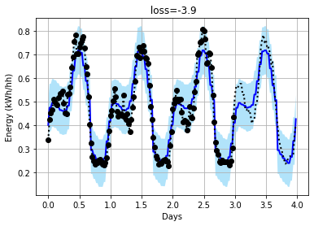

# Using attentive neural processes for forecasting power usage

This project uses [Attentive Neural Process](https://arxiv.org/abs/1901.05761) (ANP) on kaggle smart meter data.

This repository also includes a pytorch implementation that is more flexible and stable than others available now (as of 2019-11-01).

## Usage

- clone this repository
- see requirements.txt for requirements and version
- Start and run the notebook [smartmeters.ipynb](https://github.com/wassname/attentive-neural-processes/blob/master/smartmeters.ipynb)

## Data
- Some data is included, you can get more from https://www.kaggle.com/jeanmidev/smart-meters-in-london/version/11

## Example outputs

Here the black dots are input data, the dotted line is the true data. The blue line is the prediction, and the blue shadow is the uncertainty.

## Code

This is based on the code listed in the next section, with some changes. The most notable ones add stability:

Changes for stability:
- in eval mode, take mean of latent space, and mean output, don't sample
- use log_variance where possible
  - and add a minimum bound to std (in log domain) to avoid mode collapse
- use pytorch attention (which has dropout)
- use batchnorm and dropout on channel dimensions
- use log_prob loss
- check and skip nonfinite values because for extreme inputs we can still get nan's

## See also:

- Original code in tensorflow: https://github.com/deepmind/neural-processes/blob/master/attentive_neural_process.ipynb
- First pytorch implementation: https://github.com/soobinseo/Attentive-Neural-Process/blob/master/network.py
- Second pytorch implementation (has some major bugs) https://github.com/KurochkinAlexey/Attentive-neural-processes/blob/master/anp_1d_regression.ipynb
- If you want to try vanilla neural processes: https://github.com/EmilienDupont/neural-processes/blob/master/example-1d.ipynb

